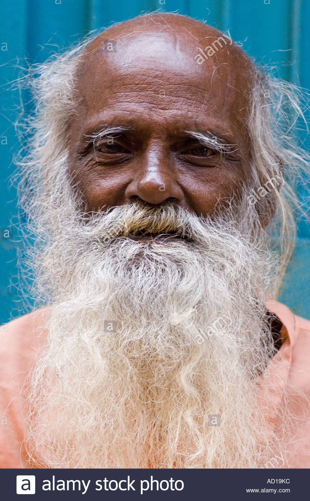

# History:

### General Character
Zah Razen is a 27yr old archaeologist with the affinity for artifacts and lore. Zah stands at an average 5’10” 180lb. His meager presence has always compelled him fill the space with knowledge about the latest discovery or current expedition.

### Brief History
Zah was raised in the furthest town from Dhamsareen that could still be considered a part of the realm named Benulth. Being the only child of two well traveled archaeologists, Zah always aspired to follow their footsteps. Stiving to learn everything from the library his parent had written and accumulated. He spent countless hours of his youth studying ancient texts and lore before moving to the Xandrios Academy. It was in his second year at the academy when his first great life event happened.

### Curse History:
In his first year of his studies and apprenticeship at Xandrios, Zah regularly came in contact with travelers that had once accompanied his parents on their travels. Zah's professors had become acutly aware of his determination to sneak into the forbidden areas of the library, warning him time and again that there scrolls and rooms he was not ready to encounter. In his youth he didn't grasp what those warning truly meant, and he swept them aside delving deeper into myths and lore far beyond his full understanding.

On many occasions Zah would linger in the great common area of Xandrios looking for specific types of visitors and parties he knew had come to research in the forbiden libraries. He became quite good at decerning which areas of research different parties had come to learn about. With a youthful, light step and no hiderances of gear he snuck quitely behind them, and used them as his key to the fobiden areas.

On one such night, Zah had his first great encounter that would forever changed who he was.

As he had done many times before, which in most cases ended with him being caught, he followed a party of travelers into the depths of the library. In this instance it was further than he had ever gone. After following the group through what seemed to be a labyrinth of doors and stairwells Zah peered around a column to spy their next step only to catch a glimps of what appeared to be the party vanishing into thin air.

By now he was well below his known levels of the library, Zah had followed the group deep into realms of the under city that was rarely mentioned by the passing travel as myth. Dimly light by his candle he moved on to the next cross section of the seeming maze. This intersection appeared to be the end of the mancured halls, the walls had become nothing more than what appeared to be a hollow out root. In his amazment and curriousity he kept on for a time and soon enough he realized he was lost.

It had been hours, feeling he had made no progress, when the dim light of his second candle illuminated a door. "By the gods ..." he muttered to himself quitely being carful not let his voice travel. Zah inspected the door and the text that was inscribed. Apon close examination he found there was an insignia on the door, almost as if it had a name. The engravings were written Aklo, a language he had only encountered in the older texts of his parent library in tales of otherworldly origins.

Having learned the bare essentials of the written language, based on his partents findings, he spent the next hour painstakingly deciphering what he believed to be a spken key to the door. When in reality the inscription was two fold and riddled so as to entrap its reader. The first part was indeed the basic command to open, the second part was a warning to leave your gods behind.

With slow, steady concentration Zah spoke the command with a stiff tongue, instinctively backed away from the door as his breath made the syllables, when slowly it began to open inward. With a slight creeking of wood the door opened, dispelling a small swell of wind accompanied by a rank odor which had an apparent continuous steam.

In an ignorant broach of unease Zah stepped forward crossing the threshold, streching out his arm to give light to the darkness and spoke a quick prayer to Nethys. "Keep well my esencs." It was a common mantra for him, never quite knowing which side of shattered divine he was treading.

As the final syllable left his tongue Zah felt the weight and rush of an aura surround him. The intensity and power that consumed his space dropped him to his hands and knees spilling his candle to the floor and dousing its light. Zah found himself unable to speak, hardly able to even breath. Silence came on him and in a slow quiet tone he heard a trembling voice speak, "Nethys, quite appropriate a moment for such a uterance." The syllables were elongated, and the vowels seemed stretched as if by a tounge too long for a human frame. "Young are you, who opens my door. Do you know that which you are approaching?"

"No", he replied, though the words spoke were not his own laguage.

A long, lazy sound like a hiss came over Zah like a warm breath from a fire.

"Nethys, though he shares my affinity from time to time, is quite inept. Your ignorance pays compliment, and awards you my blessing." The voice snickered in a hiss like manner. "Your blessing henceforth; in dire need thine tongue shall be of mine."

On hands and knees in unter blackness, beads of sweat accumulated down Zah’s face. Forceing the word he muttering in a language new to his ears. “It is knowledge I seek nothing more, grant me pardon.”

Again an elongated snickering hiss emulated from the darkness, but along with it came a heat of breath that pushed Zah to stand and stager backwards out the door and against the wall outside the entrance. With a echoeing shutter the door closed and locked itself, while at the same time it appeared to be pulling the air and dust into it's cracks.

Pulling out his third and final candle Zah light the passage and moved quickly back in the direction he thought he had come. Stagering in haste, sliding his hands along the wall as a guide, Zah made his way to the crossing where he initally left the know manacured walls of library. It wasn't long before a squad of security found him half asleep and shaking. Zah assumed they were there for him, but little did he realize his rescue was only a byproduct of a search for the party he followed and the disturbance he had roused.

As time passed Zah realized that in moments of stress or unease he could only speak and understood his own voice. The language, he was told was told by his professors was Aklo. He was marked by his fellow students as a dangerous hazard. Through the remainder of his time at the academy he found that he began to learn more rapidly than those who buried their faces in text. He was surpassing his piers in knowledge through his own personal expeditions and research dealing with the local lore of older generations.

### Expedition History Brief: (lvl 1-3)

After Zah had graduated from the academy he began to realize that he had grown in the ability to learn and consume knowledge far faster than any traditional apprenticeship. So after graduation, rather than taking an apprenticeship he began going on small expeditions in search of artifacts and secrets for those of wealth.

### Present day lvl-3:
Zah has not seen his parent in over a decade, and secretly hoped that at some time he would happen upon them in one of further expeditions. Though he never explicitly took work to seek them out it was always on his mind when beginning a new job. After some time had passed word had come that his father had been lost in an expidtion in the desert. Father was always fond of the tales of old and Zah always assumed he passed doing what he loved the most. His mother never stopped hunting and she said Zah was too much like his father to spend time with, it was too much of a bleak reminder of their loss.

### Drive or Goals:
Zah doesn’t really have a specific goal or drive other than completing his next dig or expedition. His only real goal is to stay alive and get to the next step. He is not particularly drawn to a single deity, mostly due to the overwhelming power he experienced when he was cursed.

# Zai Razen

Zah's Father

